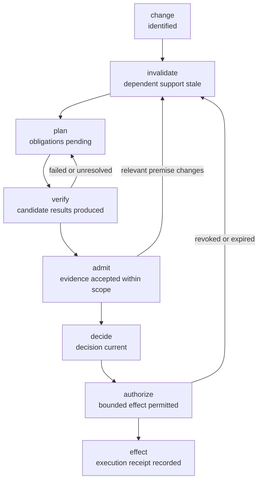

<!--
SPDX-FileCopyrightText: 2026 tao3k team and Contributors
SPDX-License-Identifier: Apache-2.0 AND LGPL-2.1-or-later
-->

# Lambda Aitia Python Runtime

This is Lambda Aitia's production Python project, not an example package.  It
is the Python runtime surface for Aitia across the complete SDLC: requirements,
design, algorithms and implementation strategies, testing, delivery, operation
and evolution. The first planning API exposes the assurance/execution protocol
used within that lifecycle:



These are semantic workflow states, not implementation-progress labels.
Feedback edges describe lifecycle reassessment, not edges returned by the
current API. The API projects only an inert, ordered eight-stage DAG, not
executed transitions. Admission, decision, authorization and execution each
require their own checked receipt.

Lambda Aitia Scheme owns the lifecycle vocabulary, assurance semantics,
decisions and receipts. POO Flow owns the reusable Graph/DAG and runtime
mechanisms. The Python package consumes those contracts through the stable C
ABI and does not reimplement either owner's semantics.

AnyIO is a production dependency for the runtime-wide asynchronous execution
boundary: structured task lifetimes, cancellation and bounded concurrency will
apply across all Aitia capabilities. The current native session is
thread-affine, so it must not be passed into `anyio.to_thread.run_sync`; an async
entry point requires a qualified owner-preserving transport before it can
claim execution.

The current production surface publishes and validates the assurance-flow
DAG through `SdlcRuntime.plan()`. The returned receipt is deliberately inert:
it cannot claim release authorization or runtime execution. Stage execution is
added only as each real Scheme operation and attributable receipt becomes
available; the package will never simulate completion with Python callbacks.

[RFC 0004](../../docs/rfcs/0004-sdlc-design-and-causal-trajectories.org) defines
the connected design and trajectory qualification. POO Flow owns generic
temporal/causal mechanisms; this project integrates actual tool execution and
scoped observations through its native boundary. Reusable upstream checker,
model and harness qualification is pending. MRR integration is deferred beyond
the current Python stage.

`lambda_aitia.verification.run_pytest` is a production subprocess observation
surface, not a Host-issued admission. It preserves exit status, selected test
count, JUnit digest and source-tree digest; zero collected tests, skipped-only
runs, timeouts, missing reports and source drift do not pass its obligation.
It captures a bounded, canonical source-byte payload and executes pytest only
from a separately materialized copy; selectors cannot escape that copy.
`capture_source_tree` and `run_pytest_frozen` expose the same payload boundary
for a future Host-owned source reader. This still does not prove repository
provenance, interpreter independence, or trusted external services. The
Assurance Host owns admission, revocation and execution authority.
The POSIX verifier runs pytest in its own process group and stops that group
on timeout or output overflow. `max_output_bytes` defaults to 8 MiB; only the
last 8 KiB is retained in the observation. Cleanup uncertainty is reported as
`control-error`, never as a passing result.

`AitiaNativeSession` keeps one Gambit transport runtime alive across calls to
`SdlcRuntime(session=...)`, `evaluate_gitops(..., session=...)`, and
`evaluate_org_contract(..., session=...)`. It is
process-exclusive and thread-affine; use it as a context manager. It does not
issue Host verification seals or admission capabilities. A separate Scheme
Host operation and opaque ABI handles are still required before Python
observations can be admitted.

`evaluate_org_contract` calls Orgize's versioned C ABI from the same initialized
native link unit. The input is a sequence of `OrgElementFact` values already
projected by the source owner, not raw Org text. Orgize owns Element graph
queries and Contract evaluation; Aitia does not parse Org or treat a matching
contract as authenticated provenance, review, admission, or effect authority.
The binary row/result layout and revision are defined in Orgize's
`bindings/c/include/orgize.h`. Aitia checks the revision before each call.

```python
from lambda_aitia import SdlcRuntime

plan = SdlcRuntime().plan("release/42")
assert plan.topological_order[-1] == "release/42/effect"
assert not plan.release_authorized
assert not plan.runtime_executed
```

Builds require `LAMBDA_AITIA_NATIVE_LIBRARY` to identify the qualified native
library that will be bundled into the wheel.

The binding is an independent uv project owned entirely by Lambda Aitia. From
this directory, synchronize and test the locked environment with:

```sh
env -u SDKROOT uv sync --locked --extra test
env -u SDKROOT uv run --locked --extra test pytest
```

Build the distributable wheel after producing the Scheme-native library:

```sh
LAMBDA_AITIA_NATIVE_LIBRARY=/absolute/path/to/libpoo_flow_aitia.dylib \
  env -u SDKROOT uv sync --locked --extra test
LAMBDA_AITIA_NATIVE_LIBRARY=/absolute/path/to/libpoo_flow_aitia.dylib \
  env -u SDKROOT uv build --wheel --offline --no-build-isolation
```

`just check-native` also installs that wheel in a fresh uv environment outside
the repository, runs the native plan, reproduces a lost-acknowledgement bug in
two real worker processes and a loopback HTTP service, checks the corrected
worker, then rejects the old observation after a source edit. This is a known
fault-injection qualification case, not a newly discovered production defect
or an Assurance Host seal.

On Darwin, the repository `justfile` selects `/usr/bin/cc`, unsets `SDKROOT`
for Gerbil invocations, and keeps the deployment metadata consistent with the
installed Gerbil/Gambit native objects. The large Gambit closure uses DWARF
unwind on arm64 because its function offsets exceed compact-unwind encoding;
this architecture-specific linker choice is not a macOS-version support
boundary.
